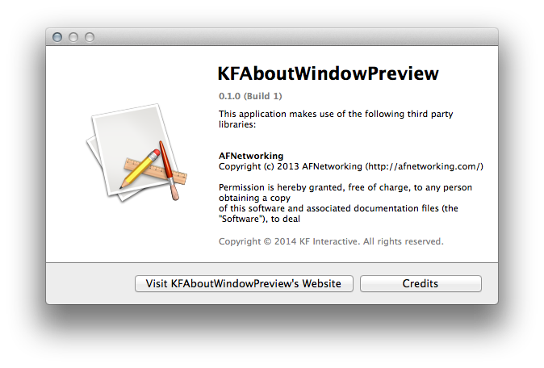

# KFAboutWindow
An about window displaying Credits from RTF and Acknowledgements from Cocoapods´ generated plist file.

This is an about window similar to Xcode's. Additionally it can handle CocoaPods Acknowledgements.plist – with one button click you have an auto scrolling list of all used Pods and their licences. You only have to copy the plist generated by Cocoapods in a [post\_install\_hook](http://guides.cocoapods.org/syntax/podfile.html#post_install) and add it to your target.

## Usage

To run the example project; clone the repo, and run `pod install` from the Project directory first.

## Screenshots
  

## Installation

KFAboutWindow is available through [CocoaPods](http://cocoapods.org), to install
it simply add the following line to your Podfile:

    pod "KFAboutWindow"

## Author

Rico Becker, [@ricobeck][1]

## License

KFAboutWindow is available under the MIT license. See the LICENSE file for more info.

[1]: http://twitter.com/ricobeck        "@ricobeck"